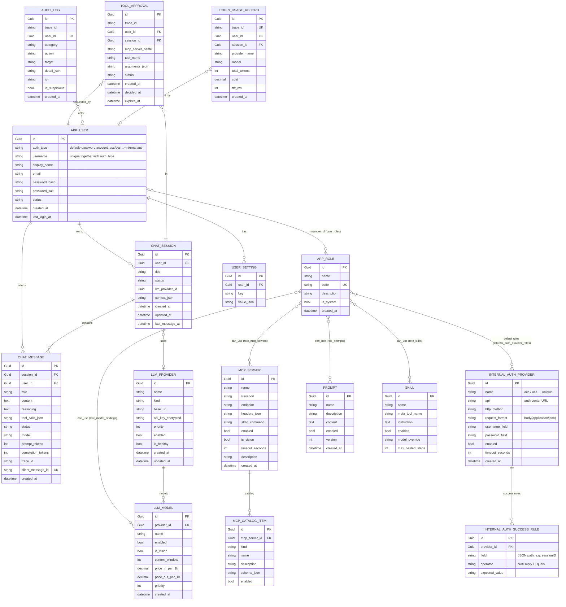
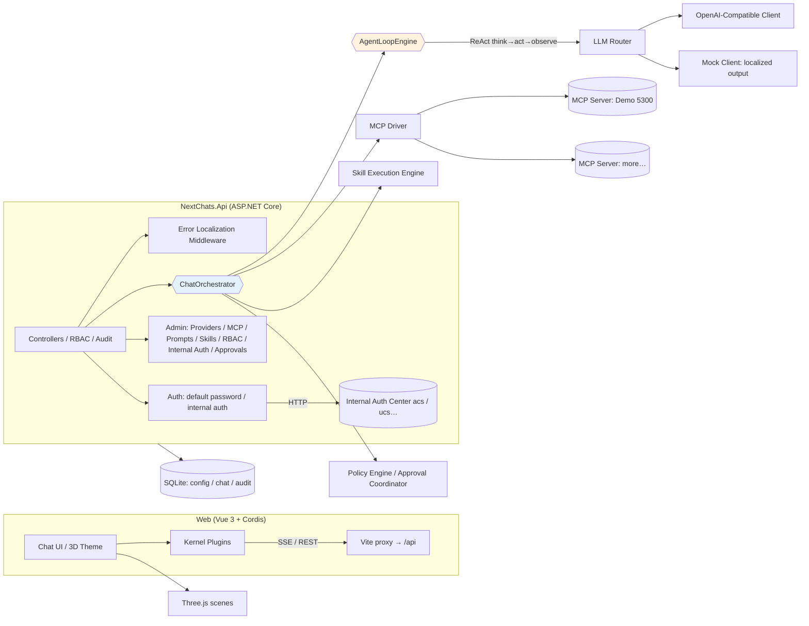
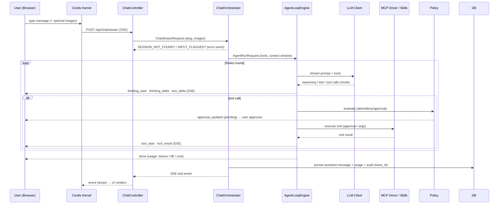
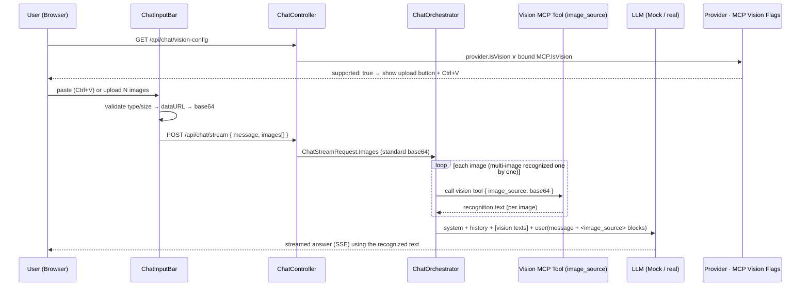
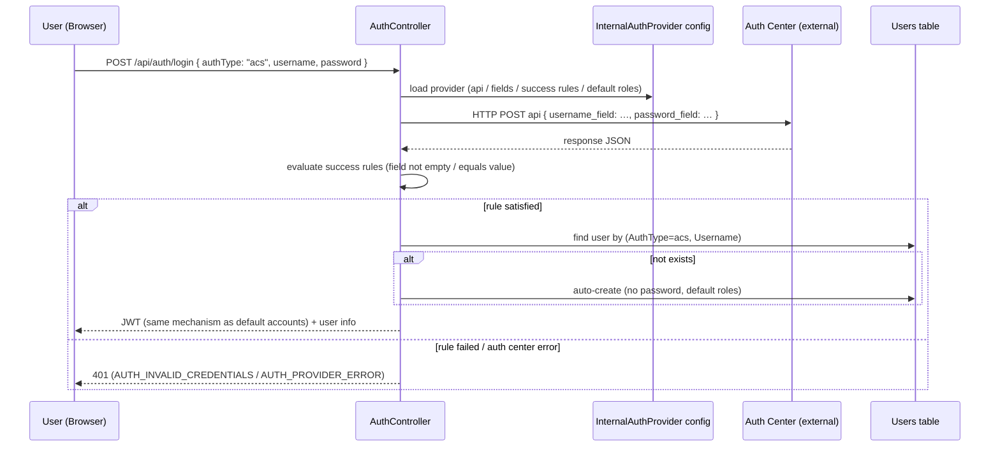

# Next Chats

> [**中文版 README（简体中文）**](./README.zh.md)

<div align="center">
  
  <p><em>Chat window (conversation / thinking / tools / topic rail)</em></p>
  <br/>
  
  <p><em>Admin console (LLM providers / MCP / RBAC / internal auth / approvals / audit / usage)</em></p>
</div>

A B/S multimodal AI chat platform based on the **DeepSeek Harness principles**: LLM + MCP (Model Context Protocol) + Skill plugin orchestration, with a **Cordis**-driven, Three.js-powered 3D frontend.

> Reference paper: *A Programming Paradigm for Spatiotemporal Composability* — everything is a plugin, driven by Cordis.

**Multilingual UI**: English (default) and 简体中文 — switch from the top bar (🌐 EN / 中文); your choice is remembered in `localStorage`.

---

## Architecture & Flows

### Data Model (ER)



### System Architecture



### Chat (ReAct) Flow — SSE streaming



### Image / Vision Flow (image_source standard base64)



## Tech Stack

| Layer | Technology |
| --- | --- |
| Backend | .NET 10 · ASP.NET Core · EF Core (SQLite now → MySQL 8 ready) |
| MCP | **ModelContextProtocol SDK 2.2.0** (latest stable) · Streamable HTTP transport · STDIO extensible |
| Frontend | Vue 3 · TypeScript · Vite · Element Plus · Three.js · **Cordis ^3.18.1** (plugin kernel) |
| Security | JWT dual-token (30-min access + rotating refresh, revoked on disable/logout) · PBKDF2-SHA256(210k) password hashing · AES-256-GCM secret encryption · sanitized audit logs |
| i18n | vue-i18n 10 (en / zh-CN, English default) · `X-Lang` error localization on the API |

## Repository Layout

```
next-chats/
├── src/
│   ├── NextChats.Core/           # Domain model, orchestration, engines, drivers (no ASP.NET dependency)
│   ├── NextChats.Infrastructure/ # EF Core data, caching, security services (swappable)
│   └── NextChats.Api/            # Web API (SSE streaming, admin, RBAC, audit, metrics, i18n)
├── samples/McpDemoServer/        # Demo MCP Server (Streamable HTTP)
├── e2e/                          # Internal-auth E2E (mock auth center + PowerShell suite)
└── web/                          # Vue 3 + Cordis frontend
    ├── src/i18n/                 # en / zh dictionaries (per-domain locale files)
    └── scripts/smoke*.mjs        # End-to-end smoke scripts (Node fetch streaming)
```

## Quick Start

```bash
# 1. Start the demo MCP Server (port 5300)
dotnet run --project samples/McpDemoServer -c Debug

# 2. Start the API (port 5210; DB is auto-created and seeded on first boot)
dotnet run --project src/NextChats.Api -c Debug

# 3. Start the frontend (Vite proxies /api → 5210)
cd web && npm install && npm run dev
# Open http://localhost:5173  (seeded admin: admin / admin123)
```

## Core Design

### Authentication (default accounts + internal auth)
- **default（system accounts）**: local password accounts (PBKDF2-SHA256), created by an admin in **User Management**; the login page defaults to `default`.
- **Internal auth (acs / ucs…)**: admins maintain auth-center configs in **Internal Auth Management** — API URL, HTTP method, the request-body field names for the username/password (`body(application/json)`), **success-response rules** (one or more fields that must be **not empty** or **equal a fixed value**, dotted paths such as `data.sessionID` supported), and the category's **default roles** (multi-select).
- The login page shows a sign-in-method radio group (`default` + enabled auth centers, from `GET /api/auth/providers`); choosing an internal method makes the backend validate the credentials against the configured auth center.
- After a successful validation the user is **auto-provisioned or reused**: internal users are unique by `(AuthType, Username)` (a `default` and an `acs` account may share a username); when the user already exists their roles are read directly, otherwise a user is created (no password, displayName = username, status Active, bound to the provider's default roles).
- Internal-auth users share the **same JWT mechanism** as default accounts: chat / catalog / permissions behave identically afterwards (role → model/MCP/Prompt/Skill bindings decide the visible scope).
- **Dual-token session (double-token)**: login issues a short-lived access token (**30 min**) plus a persisted refresh token (**7 days**, stored as SHA-256 hash). When the access token expires, the frontend silently exchanges the refresh token (`POST /api/auth/refresh`) and replays the request — active users are never logged out mid-work, idle sessions expire after 7 days. Every refresh **rotates** the token (the old one is revoked and recorded as replaced, so replays are rejected). Re-login, logout, and **user disable** revoke that user's refresh tokens immediately (a disabled account can no longer renew, and its access token dies within 30 min).



### Orchestration (Core)
- **Effective tool intersection**: `role binding ∩ user selection ∩ MCP global enabled` per user, with data isolation.
- **Active Skill matching**: Skills are exposed to the model as *meta tools* (`skill_<slug>`); instructions are lazy-loaded to avoid token explosion.
- **Prompt building**: a template engine (`{{var}}` / `#if` / `#each` / `#section`) renders system prompts.
- **ReAct loop (AgentLoopEngine)**: producer–consumer Channel architecture decouples LLM streaming from the main loop; safe interruption.

### Team collaboration (TeamOrchestrator)
- **Execution model**: each team message runs 「responsible engineer drafts a solution → assistants give independent suggestions (parallel or sequential, isolated) → responsible evaluates and produces the next-round plan (early stop on consensus) → final wrap-up」, up to `maxRounds`.
- **SSE orchestration**: a single Channel decouples production/consumption; events carry `round/phase/engineerId`: `team_start → team_round → team_text (open segment) → team_think_delta (reasoning stream) → team_tool_start/team_tool_result (tool calls) → team_delta (text stream) → team_end → end`. Interleaved parallel suggestions are routed to the right collapsible segment (Round / participant double-folding) by round+phase+engineer.
- **Tool loop (same lever as normal chat)**: engineer calls expose the same tool set as normal chat (settings-enabled MCP/skills ∩ role binding ∩ built-ins `http_fetch`/`mcp_*` ∩ session workspace `ws_*`). Models may take multiple decision steps: thinking streams live → tool calls execute directly (no approval in team mode, like Autonomous) → results feed back into `messages` → until direct text output. Tool cards reuse the normal-chat `ToolCard` component and the same toolTrace persistence shape.
- **Tool-loop guard**: at most 8 tool decision steps per engineer call; if a model keeps calling tools without ever emitting text (occasional with deep-reasoning models), one final **tool-less call** is forced so the answer is produced from the tool results — avoiding “empty solution”. Thinking accumulates across steps; text streams live.
- **Stop on consensus**: after consensus is detected in an eval round the loop converges early (no further rounds). Detection is dual-channel: the explicit `[CONSENSUS]` marker, or natural-language consensus phrasing in the output tail ("no remaining dispute", "达成一致"…); only the tail is checked to avoid false positives from “partly agreed but still disputed”.
- **Failure tolerance**: solution/suggestion/eval/final calls retry once on transient errors or empty replies (tokens/cost from both attempts are counted); only then a `TEAM_*_FAIL` is recorded, with the reason persisted as placeholder content, and the session stays usable.
- **Config semantics**: disabling team mode allows an empty/missing engineer list (config is kept for reuse and completeness checks are skipped); strict checks (1 responsible + ≥1 assistant, unique names, model availability/role binding) apply only when **enabling**.
- **Token / timing semantics**: TTFT = real first-token latency per segment (first reasoning/text delta); total time = wall-clock sum of segments; `ReasoningTokens` is a separate field (shown in the usage panel) and **included in cost** (output price). `RoundsJson` persists `text/thinking/tools` per segment for faithful replay rendering.
- **Engineer model settings**: reasoning enabled (`ThinkingEnabled/EnableReasoning`, effort Medium); reasoning deltas stream as `team_think_delta` and persist as collapsible blocks.

### Server-side Unified Configuration (Admin)
- LLM providers (enable flag / model / endpoint / encrypted api-key / temperature / context-window)
- MCP servers (Name / Endpoint / Headers JSON encrypted; **"Fetch" auto-discovers** tools/prompts/resources with schemas; per-item disable)
- Multiple Prompts & Skills (pluggable, lazy-load)
- RBAC: users / roles; role ↔ MCP / Prompt / Skill / **LLM model** bindings —— bound models are the only models the role's users can see/select, and direct API calls with an unauthorized model id are rejected server-side (`MODEL_NOT_AUTHORIZED`)
- **Internal Auth**: auth-center configs (acs / ucs…) with success-response rules and default roles (see Authentication above)

### Engines (Core)
- **LLM Router**: multi-vendor priority + round-robin + failover (mark-unhealthy circuit breaking); OpenAI-compatible & Mock clients.
- **MCP driver**: strictly follows the latest MCP spec (see [MCP 2026-07 revision](https://blog.modelcontextprotocol.io/posts/2026-07-28/)); connection pooling; call retry with backoff.
  **MCP errors go into the loop** — tool errors are fed back to the model as tool results for retry/explanation; sessions never break because of an MCP error.
- **Policy engine**: `Allow → Deny → RequireApproval` with dangerous-operation heuristics (`delete_all` etc.); approvals support pending/approved/rejected/expired.
- **Context manager**: token estimate → compress (LLM summary) → truncate; never exceeds the model length limit and never interrupts the session.

### Observability & Cost
- `trace_id` (`trc_...`) flows through Orchestration / LLM / MCP / Audit; token accounting in/out; metrics: TTFT, tokens, cost, tool latency, approval count (`/api/admin/metrics/usage`).
- Idempotent writes: unique (UserId, ClientMessageId) key; key chat logs persist across restarts.

### Logging, three channels
- **To the user**: friendly message + error code (no stack / endpoint / header)
- **To the model**: tool errors are re-fed as tool results (retryable, explainable)
- **To the logs**: full context (sanitized)

## Internationalization
- Frontend: `vue-i18n` with per-domain locale files under `web/src/i18n/locales/{en,zh}/`; English is the default locale.
- Backend: every user-visible message lives in one dictionary (`src/NextChats.Core/Localization/Texts.cs`, en/zh) — no hard-coded UI text in code. The API localizes errors via the `X-Lang` request header (or `Accept-Language`), so non-browser clients get the same language, e.g. `curl -H "X-Lang: en"`; seeded content (roles, prompts, skills, demo provider) is English.
- README: this English file and [README.zh.md](./README.zh.md) are linked at the top.

## Smoke Verification (web/scripts/ + e2e/)

```bash
node scripts/smoke.mjs          # login → create session → SSE streaming chat → persistence → metrics
node scripts/smoke-tools.mjs    # ReAct tool call (tool:echo) → dangerous approval flow (danger:delete_all)

# Internal-auth E2E (mock auth center + PowerShell suite, see e2e/README.md)
node e2e/mock-auth.js           # start mock auth center (127.0.0.1:53131)
powershell -File e2e/run-internal-auth-e2e.ps1   # assert CRUD / providers / auto-provision / uniqueness / role-based catalog
```

## MCP References
- [What's new in MCP (2026-07-28)](https://blog.modelcontextprotocol.io/posts/2026-07-28/)
- ModelContextProtocol C# SDK 2.2.0: `McpClient.CreateAsync` + `HttpClientTransport` (Streamable HTTP) / `StdioClientTransport`
