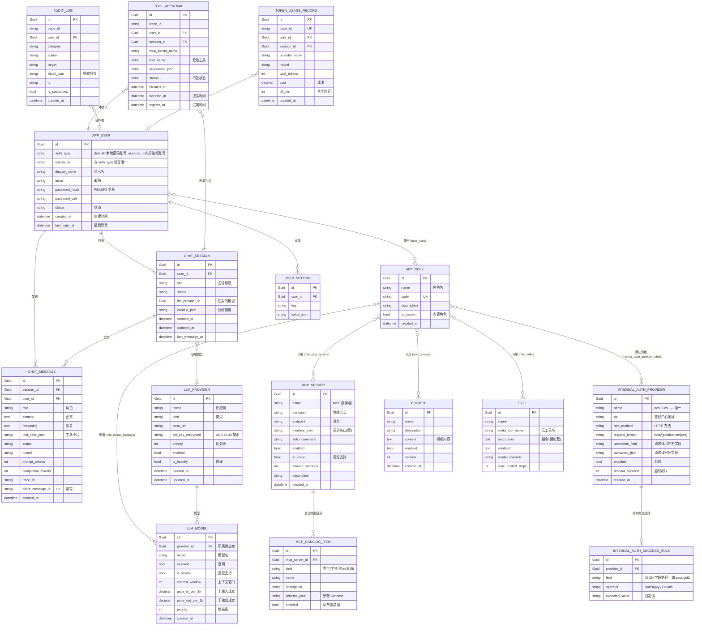
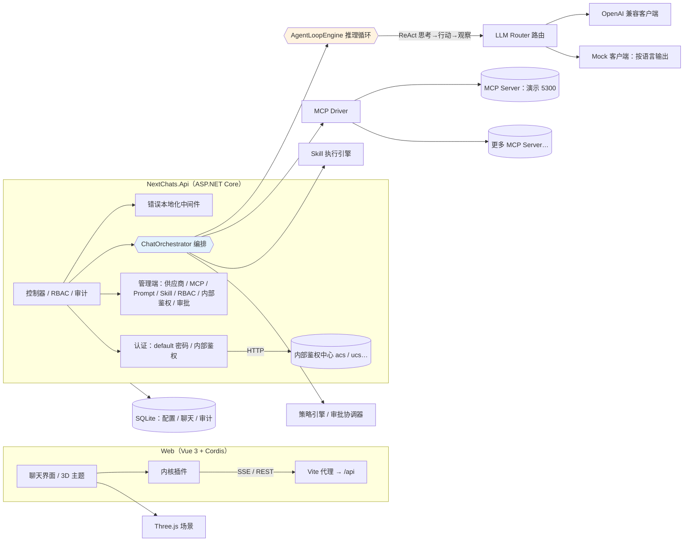
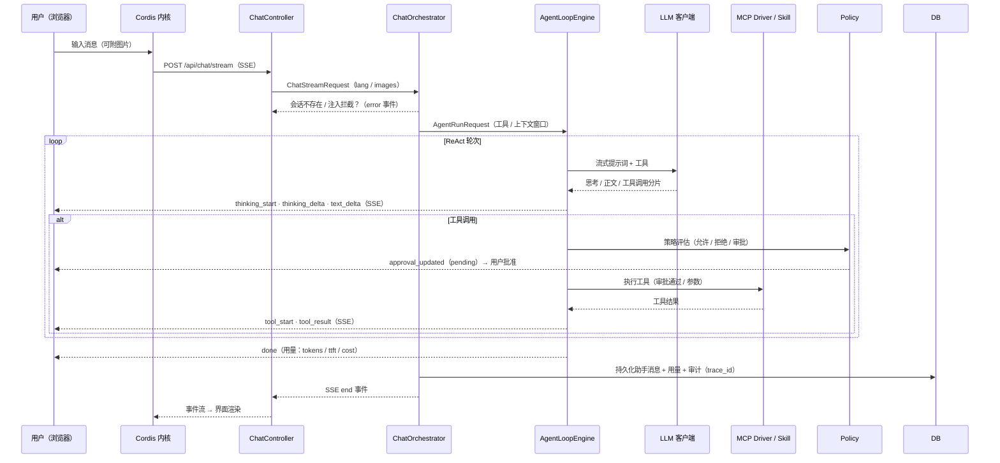
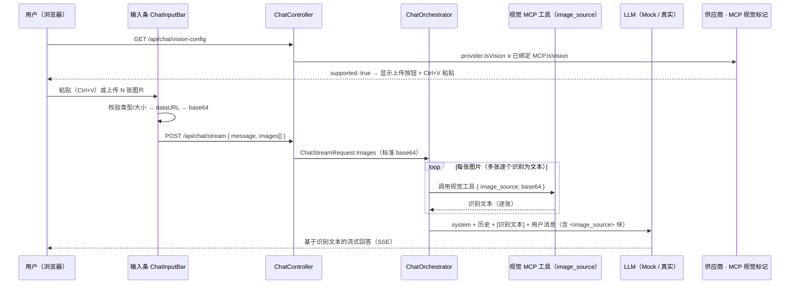
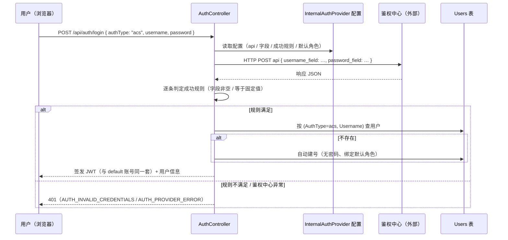

# Next Chats

> [**English README**](./README.md)

<div align="center">
  
  <p><em>聊天窗口（对话 / 思考 / 工具 / 话题导航）</em></p>
  <br/>
  
  <p><em>管理后台（LLM 供应商 / MCP / RBAC / 内部鉴权 / 审批 / 审计 / 用量）</em></p>
</div>

基于 **DeepSeek Harness 原理** 的 B/S 多模态 AI 聊天平台：LLM + MCP（Model Context Protocol）+ Skill 插件化编排，前端由 **Cordis** 插件内核驱动 Three.js 轻量 3D 界面。

> 参照论文：*A Programming Paradigm for Spatiotemporal Composability* —— 一切皆插件，由 Cordis 驱动。

**多语言界面**：中文（简体）与 English 双语，默认英文；右上角 🌐 一键切换，选择保存在 `localStorage` 自动记住。

---

## 架构与流程（MERMAID）

### 数据模型（ER 图）



### 系统架构



### 聊天（ReAct）流程 —— SSE 流式



### 图片 / 视觉流程（image_source 标准 base64）



## 技术栈

| 层 | 技术 |
| --- | --- |
| 后端 | .NET 10 · ASP.NET Core · EF Core（现 SQLite → 可切 MySQL 8）|
| MCP | **ModelContextProtocol SDK 2.2.0**（最新稳定版）· Streamable HTTP 传输 · STDIO 可扩展 |
| 前端 | Vue 3 · TypeScript · Vite · Element Plus · Three.js · **Cordis ^3.18.1**（插件内核）|
| 安全 | JWT 双令牌（30 分钟 access + 轮换式 refresh，禁用/登出即撤销）· PBKDF2-SHA256(210k) 密码 · AES-256-GCM 密钥加密 · 审计日志脱敏 |
| 国际化 | vue-i18n 10（中英双语，默认英文）· 后端错误经 `X-Lang` 请求头本地化 |

## 目录结构

```
next-chats/
├── src/
│   ├── NextChats.Core/           # 领域模型、编排层、引擎、驱动（可移植，无 ASP.NET 依赖）
│   ├── NextChats.Infrastructure/ # EF Core 数据 + 缓存 + 安全服务（可替换实现）
│   └── NextChats.Api/            # Web API（SSE 流、管理端、RBAC、审计、指标、i18n）
├── samples/McpDemoServer/        # 演示 MCP Server（Streamable HTTP）
├── e2e/                          # 内部鉴权 E2E（mock 鉴权中心 + PowerShell 套件）
└── web/                          # Vue 3 + Cordis 前端
    ├── src/i18n/                 # en / zh 分域语言包
    └── scripts/smoke*.mjs        # 端到端冒烟脚本（Node fetch 流式读取）
```

## 快速开始

```bash
# 1. 启动演示 MCP Server（端口 5300）
dotnet run --project samples/McpDemoServer -c Debug

# 2. 启动 API（端口 5210；首次启动自动建库 + 种子数据）
dotnet run --project src/NextChats.Api -c Debug

# 3. 启动前端（Vite 代理 /api → 5210）
cd web && npm install && npm run dev
# 打开 http://localhost:5173 （种子管理员：admin / admin123）
```

## 核心设计

### 认证（default 账号 + 内部鉴权）
- **default（系统账号）**：本地密码账号（PBKDF2-SHA256），由管理员在「用户管理」创建；登录页默认选择 `default`。
- **内部鉴权（acs / ucs…）**：管理员在「内部鉴权管理」维护鉴权中心配置 —— API 地址 / HTTP 方法 / 请求体中账号、密码的字段名（`body(application/json)`）/ 成功响应判定规则（一个或多个字段**不为空**或**等于固定值**，支持点路径如 `data.sessionID`）/ 该鉴权类别的**默认角色**（多选）。
- 登录页出现登录方式单选（`default` + 已启用的鉴权方式，来源 `GET /api/auth/providers`）；选择内部鉴权后，后端按配置调用鉴权中心验证账号密码。
- 鉴权通过后**自动建号或直接取号**：内部用户唯一性 = `(AuthType, Username)`（default 与 acs 账号可同名）；已存在则直接读取其角色权限，不存在则自动创建（无密码、用户名=显示名、状态正常、绑定鉴权配置的默认角色）。
- 内部鉴权用户与默认用户共用**同一套 JWT** 机制，后续聊天 / 目录 / 权限全部一致（角色 → 模型/MCP/Prompt/Skill 绑定决定可见范围）。
- **双令牌会话（JWT + Refresh Token）**：登录签发短时 access token（**30 分钟**）与持久化 refresh token（**7 天**，仅存 SHA-256 哈希）。access 过期时前端用 refresh 静默续期（`POST /api/auth/refresh`）并自动重放原请求——活跃用户不会中途被踢，空闲 7 天以上才需重新登录。每次续期都**轮换**（旧令牌撤销并记录替换者，重放即拒）。重新登录、登出、**用户被禁用**都会立即撤销该用户全部 refresh token（被禁账号无法再续期，其 access 最多残留 30 分钟）。



### 编排层（Core）
- **有效交集工具集**：`角色绑定 ∩ 用户启用 ∩ MCP 全局启用` 取交集，逐用户隔离。
- **活跃 Skill 匹配**：Skill 以「元工具」形式暴露给模型（`skill_<slug>`），指令按需懒加载，避免 token 爆炸。
- **Prompt 构建**：模板引擎（`{{var}}` / `#if` / `#each` / `#section`）渲染系统提示。
- **ReAct 循环（AgentLoopEngine）**：生产者-消费者 Channel 架构；LLM 流式事件与循环主流程解耦，可安全中断。

### 团队协作（TeamOrchestrator）
- **执行模型**：每条团队消息按「责任工程师产出方案 → 协助工程师并行/串行独立建议（互不感知）→ 责任工程师评估并产出下一轮方案（共识即收敛）→ 终轮汇总」迭代，最多 `maxRounds` 轮。
- **SSE 编排**：单 Channel 生产/消费解耦，事件带 `round/phase/engineerId` 归属：`team_start → team_round → team_text（开段）→ team_think_delta（思考增量）→ team_tool_start/team_tool_result（工具调用）→ team_delta（正文增量）→ team_end → end`；并行建议流交错时按「同轮+同阶段+同工程师」归位到对应折叠段（Round / 参与者双折叠）。
- **工具循环（与普通聊天同口径）**：工程师调用携带与普通聊天一致的工具集（设置勾选 MCP/技能 ∩ 角色绑定 ∩ 内置 `http_fetch`/`mcp_*` ∩ 会话工作空间 `ws_*`），模型可多步决策：思考实时展示 → 发起工具调用（团队场景无审批，等同 Autonomous 直接执行）→ 结果回灌 `messages` 继续决策 → 直接输出正文为止；工具卡事件与普通聊天同一 `ToolCard` 组件、同一 toolTrace 持久化结构。
- **工具循环兜底**：单次工程师调用上限 8 个工具决策步；若模型持续调工具而始终未输出正文（深度推理模型偶发），自动追加一次**无工具收尾调用**强制基于已有工具结果直接作答，避免「空方案」；跨步思考累积展示，正文实时下发。
- **无争议提前结束（stopOnConsensus）**：评估阶段判定共识后提前收敛（不再进入下一轮）。共识检测为**双通道**：`[CONSENSUS]` 显式标记，或输出末尾区域的自然语言共识表述（"no remaining dispute / 达成一致 / 无异议…"，仅检查结尾避免"部分同意但仍有异议"误判）。
- **失败容错**：方案/建议/评估/终稿任一调用失败（网关瞬断）或空回复自动重试一次，重试成功的 token/费用全部计入；仍失败才落 `TEAM_*_FAIL`，失败原因作为占位内容持久化（刷新可见），会话可继续提问、不中断。
- **配置语义**：关闭团队模式允许工程师列表为空/模型暂缺（配置保留供下次启用复用，不做完整性校验）；仅**启用**时严格校验（责任 1 人 + 至少 1 协助 + 名称查重 + 模型可用/角色绑定）。
- **Token / 耗时口径**：TTFT = 每段真实首 token（思考/正文首增量）时延；总耗时 = 各段墙钟累加；`ReasoningTokens` 独立字段（前端明细面板展示），费用计算**含推理 token**（按输出单价）；`RoundsJson` 每段持久化 `text/thinking/tools`（工具轨迹同普通聊天），历史重放即渲染。
- **工程师模型要求**：思考模式开启（`ThinkingEnabled/EnableReasoning`，强度 Medium），推理增量以 `team_think_delta` 下发并持久化，可折叠展示。

### 引擎（Core）
- **LLM Router**：多供应商优先级 + 轮询 + 故障转移（mark-unhealthy 熔断），OpenAI 兼容 / Mock 双客户端。
- **MCP 驱动**：严格最新 MCP 规范（引用 [MCP 2026-07 修订](https://blog.modelcontextprotocol.io/posts/2026-07-28/)）；连接池复用；调用重试（指数退避）；
  **MCP 错误进循环** —— 工具错误作为工具结果回灌给模型用于重试/解释，会话绝不因此中断。
- **策略引擎**：`Allow → Deny → RequireApproval` 三级裁决 + 危险操作符号名启发式（如 `delete_all`）；审批支持 pending/approved/rejected/expired。
- **上下文管理**：token 估算 → 压缩（LLM 摘要）→ 截断，绝不超过模型长度上限，全程不中断会话。

### 服务端统一配置（管理端）
- LLM 供应商（启用开关 / model / endpoint / api-key 加密 / temperature / context-window）
- MCP 服务器（Name / Endpoint / Headers JSON 加密保存；**「获取」自动带出** tools/prompts/resources 并以 Schema 落库；逐项禁用）
- Prompt 多套、Skill 多套（可插拔懒加载）
- RBAC：用户 / 角色；角色 ↔ MCP / Prompt / Skill / **LLM 模型** 绑定 —— 绑定后角色的用户仅可见/可选绑定内的模型，直接调 API 传未授权模型 ID 也会在服务端拒绝（`MODEL_NOT_AUTHORIZED`）
- **内部鉴权管理**：鉴权中心配置（acs / ucs…），含成功响应判定规则与默认角色（详见上文「认证」）

### 可观测性与成本
- `trace_id`（`trc_...`）贯穿 Orchestration / LLM / MCP / 审计；token 进出统计；指标：TTFT、tokens、cost、工具时延、审批数（`/api/admin/metrics/usage`）。
- 幂等写入：（UserId, ClientMessageId）唯一键；关键聊天日志持久化，重启不丢消息。

### 日志三通道
- **给用户**：友好文案 + 错误码（无 stack / endpoint / header）
- **给模型**：工具错误作为 tool result 回灌（可重试、可解释）
- **给日志**：完整上下文（含脱敏后的）

## 国际化
- 前端：`vue-i18n`，语言包按域拆分于 `web/src/i18n/locales/{en,zh}/`，默认英文。
- 后端：所有用户可见文案集中在单一字典 `src/NextChats.Core/Localization/Texts.cs`（中英双语），代码中不再硬编码界面文案；错误响应经 `X-Lang` 请求头（或 `Accept-Language`）本地化，非浏览器客户端（如 `curl -H "X-Lang: zh"`）同样获得对应语言；种子数据（角色/Prompt/Skill/演示供应商）为英文。
- 本文档与 [README.md（英文）](./README.md) 顶部互链。

## 冒烟验证（web/scripts/ + e2e/）

```bash
node scripts/smoke.mjs          # 登录 → 建会话 → SSE 流式对话 → 消息持久化 → 指标
node scripts/smoke-tools.mjs    # ReAct 工具调用（tool:echo）→ 危险工具审批流（danger:delete_all）

# 内部鉴权 E2E（mock 鉴权中心 + PowerShell 套件，见 e2e/README.md）
node e2e/mock-auth.js           # 启动 mock 鉴权中心（127.0.0.1:53131）
powershell -File e2e/run-internal-auth-e2e.ps1   # 断言 CRUD / 登录方式 / 自动建号 / 唯一性 / 角色目录
```

## MCP 参考
- [What's new in MCP (2026-07-28)](https://blog.modelcontextprotocol.io/posts/2026-07-28/)
- ModelContextProtocol C# SDK 2.2.0：`McpClient.CreateAsync` + `HttpClientTransport`（Streamable HTTP）/ `StdioClientTransport`
